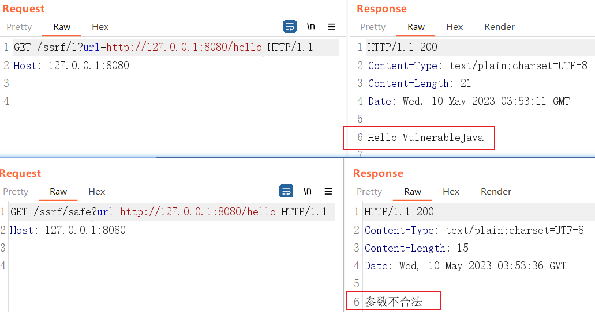
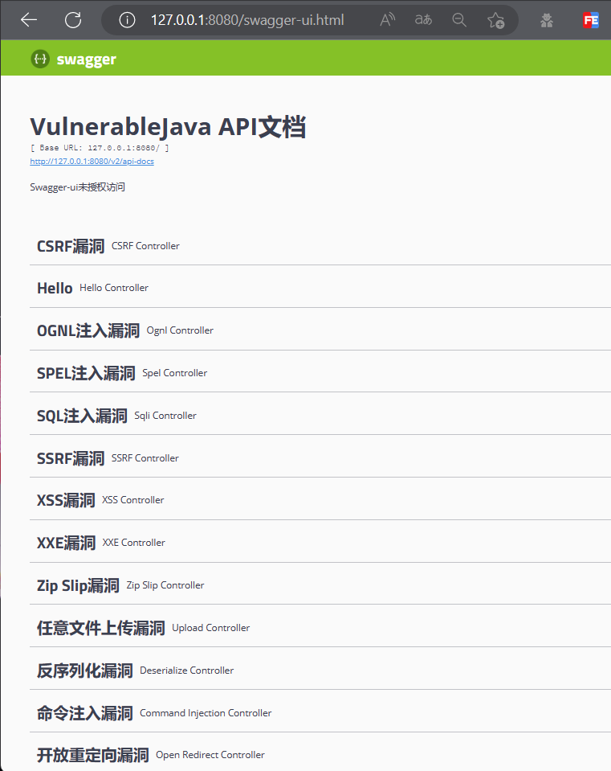
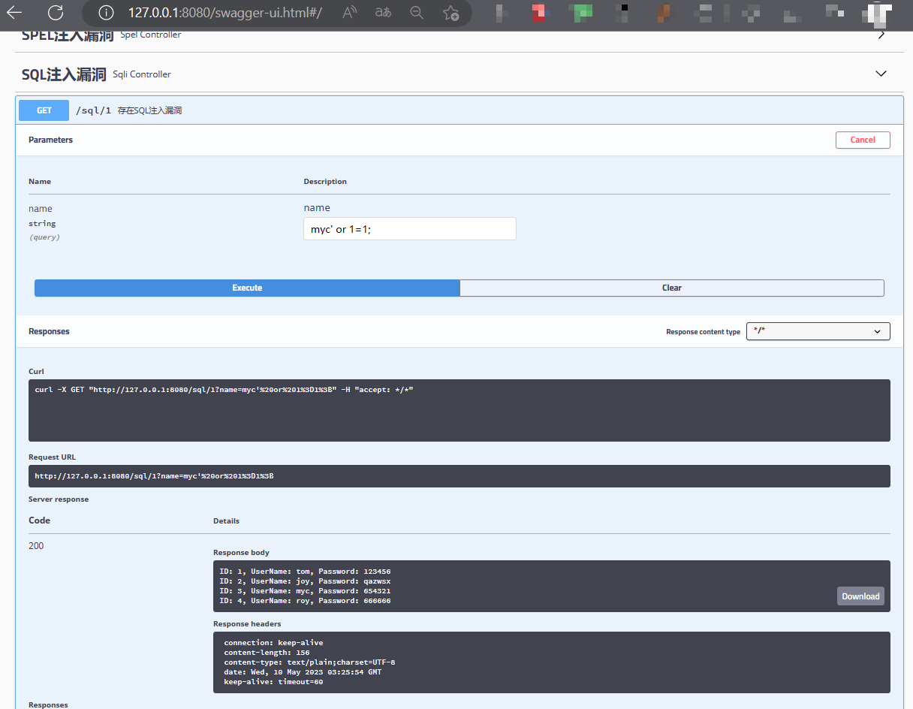

# VulnerableJava

常见漏洞示例代码、修复方案、白盒检测误报案例。Java版本。

## 漏洞数量

| 漏洞类型 | 漏洞数量 | 误报数量 |
| :------ | :------ | :------- |
| 命令注入 | 1 | 3 |
| 硬编码   | 1 | 2 |
| 开放重定向 | 2 | 3 |
| 目录穿越 | 1 | 4 |
| SPEL注入 | 2 | 3 |
| OGNL注入 | 1 | 1 |
| EL注入 | 1 | 1 |
| Freemarker注入 | 1 | 1 |
| Thymeleaf注入 | 2 | 1 |
| Velocity注入 | 1 | |
| SQL注入 | 7 | 11 |
| SSRF | 4 | 10 |
| CSRF | 1 | 2 |
| 任意文件上传 | 1 | 2 |
| XSS | 2 | 1 |
| XXE | 1 | 1 |
| Zip Slip | 1 | 1 |
| 反序列化 | 1 | 2 |
| 文件包含 | 2 | |
| Spring Actuator 未授权 | 1 | |
| Swagger-ui未授权 | 1 | |
| 阿里巴巴 Druid 未授权 | 1 | |
| Fastjson RCE | 1 | 1 |
| Shiro | 1 | |

误报数量 = 漏洞修复数量 + 误报案例数量

## 漏洞详情

漏洞源码主要在[controller](./src/main/java/com/example/vulnerablejava/controller/)目录下，详情可参考代码注释信息。

## 漏洞验证方式

执行 `mvn spring-boot:run` 或 `java -jar vulnerablejava.jar`运行项目，使用curl或burp进行验证即可，例如:

或直接访问 `http://127.0.0.1:8080/swagger-ui.html` ，如下:

选择其中漏洞进行测试，例如:

## 注意

0. 主要用于验证SAST产品常规漏洞准确性及覆盖面
1. 默认使用内置sqlite数据库，打包后可直接运行
2. 无前端项目，内置swagger辅助测试
3. 漏洞详情、利用方式，主要在[controller](./src/main/java/com/example/vulnerablejava/controller/)文件注释中
